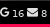

# UnseenMail
Polybar Python script for viewing unread email from multi accounts

Only works with IMAP Protocol (working on others like Google API)

 

# Dependencies
- Polybar
- FontAwesome V4 (see your Distribution font configuration)

# Install

1 - Clone this repo

2 - Add following to your polybar configuration file

	  [module/unread_mail]
	  type = custom/script
	  
	  label-font = 2
	  format-underline = #f50a4d
	  click-left=  thunderbird & ; you can set your own client
	  format = <label>
	  exec = python path/to/python/script/UnseenMail.py
	  interval = 100

3 - Add accounts to accounts.ini (in script folder)

	#Configuration example for email accounts
	[Example]
	protocol=IMAP
	host=imap.gmail.com
	port=993
	useSSL = true
	login = email
	password = password
	icon=

4 - Run it !